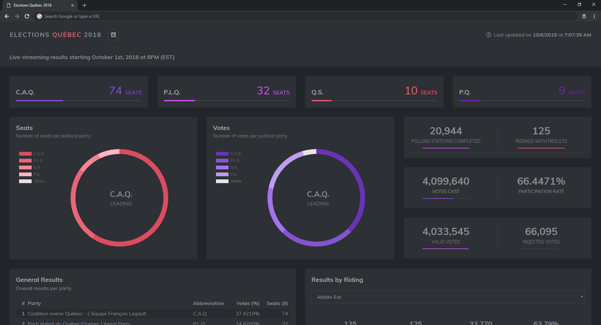

# Quebec 2018 Election Results
> Dashboard for Quebec's 2018 electoral results

## Live Dashboard

Live dashboard: [https://philsawicki.github.io/quebec-elections-2018](https://philsawicki.github.io/quebec-elections-2018)

## Installation

Prerequisite: [NodeJS](https://nodejs.org) (>= 10.0.0)

Installation steps:
 1. Run `npm install`
 2. Run `npm run compile` (or `npm run compile:watch` during development)
 3. Run `npm run serve`
 4. Navigate to [http://localhost:3001](http://localhost:3001)
